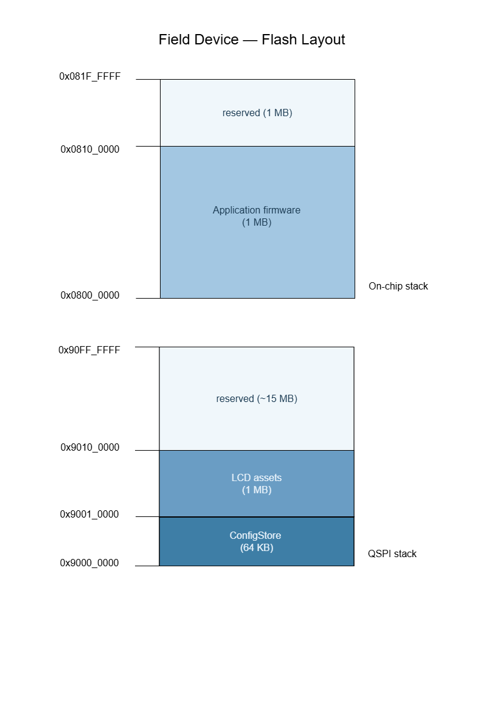
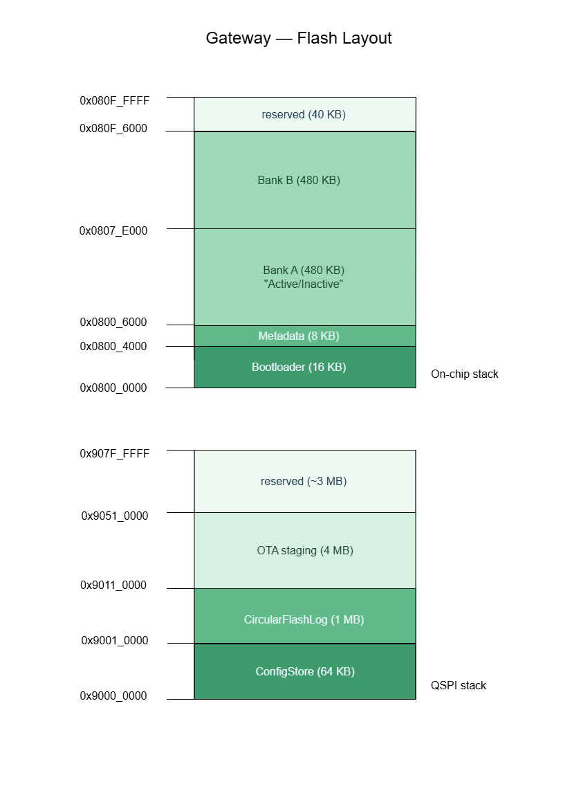

# HLD Artefact #8 — Flash Partition Layout

**Companion document to `hld.md`.** This artefact specifies the
non-volatile memory layout for both boards: every flash partition on
the on-chip and external flash, with addresses, sizes, purposes, and
wear-levelling decisions. It is the physical foundation for the
bootloader, OTA, `ConfigStore`, `DeviceProfileRegistry`, and
`CircularFlashLog`.

---

## 1. Purpose and scope

This document defines the physical memory map of both boards. It is the
contract between the bootloader, the application firmware, and the
storage middleware (`ConfigStore`, `FirmwareStore`, `CircularFlashLog`).
Every address, every sector boundary, and every partition size below is
authoritative — the LLD-phase linker scripts and bootloader code derive
their constants directly from this document. Cross-references: SD-06a–d
(OTA flow), `state-machines.md` Firmware Update sub-machine,
`components.md` storage components.

The document does **not** define LLD-level artefacts. The `.ld` linker
scripts, the bootloader's C source, and the per-partition driver
implementations all live in the LLD phase. Nor does it define the OTA
wire protocol — that is covered by SD-06a–d and (for the master-slave
Modbus command path) by `modbus-register-map.md`.

---

## 2. Physical memory inventory

### 2.1 Field Device — STM32F469NI on STM32F469 Discovery

**On-chip flash** (per UM1932 §5 and STM32F469NI datasheet):
- Address range: `0x0800_0000 – 0x081F_FFFF` (2 MB total)
- Organisation: dual-bank (1 MB per bank)
- Sectors per bank:
  - 4 × 16 KB (sectors 0–3 / 12–15)
  - 1 × 64 KB (sector 4 / 16)
  - 7 × 128 KB (sectors 5–11 / 17–23)

**External Quad-SPI flash** (per UM1932 §6, MX25L51245G or equivalent):
- Address range when memory-mapped: `0x9000_0000 – 0x90FF_FFFF` (16 MB)
- Sector size: 4 KB
- Programming: page (256 B), erase (4 KB / 32 KB / 64 KB)

### 2.2 Gateway — STM32L475VG on B-L475E-IOT01A

**On-chip flash** (per UM2153 §6 and STM32L475VG datasheet):
- Address range: `0x0800_0000 – 0x080F_FFFF` (1 MB total)
- Sector size: uniform 2 KB
- Sectors: 512 × 2 KB

**External Quad-SPI flash** (per UM2153, MX25R6435F):
- Address range when memory-mapped: `0x9000_0000 – 0x907F_FFFF` (8 MB)
- Sector size: 4 KB
- Programming: page (256 B), erase (4 KB / 32 KB / 64 KB)

---

## 3. Partitioning principles

The following principles apply uniformly across both boards.

1. **Bootloader at reset vector.** When present, the bootloader occupies
   the first sectors of on-chip flash so the MCU starts executing it on
   power-up. Application firmware lives after the bootloader.
2. **Sector alignment.** Every partition starts on a sector boundary. On
   on-chip flash this means honouring the MCU's native sector layout
   (variable on F469, uniform 2 KB on L475). On QSPI it means 4 KB
   alignment.
3. **Reserved tail.** Each region of flash reserves space at the end for
   future expansion. Better to under-use flash today than to renumber a
   partition tomorrow.
4. **Write frequency drives placement.** Frequently written data goes to
   QSPI (larger, cheaper-per-byte, wear-levellable). One-time-programmed
   or rarely written data stays on-chip.
5. **Wear-hot partitions** (logs, config) carry an explicit wear-levelling
   strategy documented in §6.

---

## 4. Field Device partition layout

The Field Device does not support OTA *(D35)*. Its layout is
correspondingly simpler than the Gateway's: single firmware bank, no
rollback, no dual-bank metadata. Firmware is flashed via SWD at the
bench or during manufacturing.

### 4.1 On-chip flash *(2 MB)*

| Partition | Start | End | Size | Purpose | Lifetime | Requirement |
|---|---|---|---|---|---|---|
| Application firmware | `0x0800_0000` | `0x080F_FFFF` | 1 MB | Field Device firmware (XIP) | Programmed at flash time | REQ-NF-404 |
| *(reserved)* | `0x0810_0000` | `0x081F_FFFF` | 1 MB | Future expansion; sized to accommodate a second bank if OTA is added later, preserving forward compatibility | — | — |

The 1 MB application allocation gives ample headroom over the expected
firmware footprint. A reference footprint with LVGL configured for the
target LCD resolution, the Modbus slave stack, three sensor drivers,
FreeRTOS, and the application code is typically 300–500 KB. The 1 MB
budget leaves a 2× growth margin, which is the project's standing rule.

### 4.2 External QSPI flash *(16 MB)*

| Partition | Start | End | Size | Purpose | Wear strategy | Requirement |
|---|---|---|---|---|---|---|
| `ConfigStore` | `0x9000_0000` | `0x9000_FFFF` | 64 KB | Persisted configuration (alarm thresholds, sampling period, LCD config) | A/B sector rotation (§6.1) | REQ-DM-090 |
| LCD assets | `0x9001_0000` | `0x900F_FFFF` | 960 KB | LVGL fonts, bitmaps, themes; loaded by the LCD subsystem as binary blobs | Programmed at flash time | REQ-NF-405 |
| *(reserved)* | `0x9010_0000` | `0x90FF_FFFF` | ~15 MB | Future use (recipes, calibration data, extended LCD assets) | — | — |

ConfigStore's 64 KB is sized for the current schema (alarm thresholds,
sampling period, LCD parameters) with generous headroom and enough
sectors for A/B rotation across multiple slots. LCD assets are
constrained to 960 KB (0x9001_0000 – 0x900F_FFFF) — the LVGL
configuration for the chosen LCD resolution and typical font/bitmap
counts fits well within this budget.

### 4.3 Field Device partition diagram

---

## 5. Gateway partition layout

The Gateway supports OTA with **dual-bank A/B firmware**, atomic boot
pointer swap, and self-check rollback (SD-06a–d, `state-machines.md`
Firmware Update sub-machine).

### 5.1 On-chip flash *(1 MB)*

| Partition | Start | End | Size | Sectors | Purpose | Lifetime |
|---|---|---|---|---|---|---|
| Bootloader | `0x0800_0000` | `0x0800_3FFF` | 16 KB | 8 × 2 KB | Custom secondary bootloader: image-header check, boot-pointer dispatch, self-check supervision *(D36)* | Rarely updated |
| Metadata | `0x0800_4000` | `0x0800_5FFF` | 8 KB | 4 × 2 KB | Boot pointer (active bank), pending_self_check flag, image headers (version, CRC, signature), rollback count | Written during OTA commit and on self-check |
| Bank A (firmware) | `0x0800_6000` | `0x0807_DFFF` | 480 KB | 240 × 2 KB | Active or inactive firmware image; XIP from either bank | Written during OTA |
| Bank B (firmware) | `0x0807_E000` | `0x080F_5FFF` | 480 KB | 240 × 2 KB | Active or inactive firmware image; XIP from either bank | Written during OTA |
| *(reserved)* | `0x080F_6000` | `0x080F_FFFF` | 40 KB | 20 × 2 KB | Future expansion (extended metadata, factory area, etc.) | — |

**Total:** 16 + 8 + 480 + 480 + 40 = 1024 KB = 1 MB ✓

### 5.2 External QSPI flash *(8 MB)*

| Partition | Start | End | Size | Purpose | Wear strategy |
|---|---|---|---|---|---|
| `ConfigStore` | `0x9000_0000` | `0x9000_FFFF` | 64 KB | Operational config + `DeviceProfileRegistry` profiles *(D17, D18)* | A/B sector rotation (§6.1) |
| `CertStore` | `0x9001_0000` | `0x9001_FFFF` | 64 KB | X.509 client certificates and private keys *(CON-006, REQ-NF-302)*; one slot per provisioned device identity | Write-once; re-provisioned by secure channel only |
| `CircularFlashLog` | `0x9002_0000` | `0x9011_FFFF` | 1 MB | Diagnostic log ring buffer (REQ-NF-500 series); also the non-volatile backing store for `StoreAndForward` during cloud outages (REQ-BF-000..-020, REQ-NF-407) | Circular overwrite (§6.2) |
| OTA staging | `0x9012_0000` | `0x9051_FFFF` | 4 MB | Download buffer for OTA images; allows the full image to be received, validated, and signature-checked before any on-chip write to Bank B | Erased per OTA cycle |
| *(reserved)* | `0x9052_0000` | `0x907F_FFFF` | ~2.75 MB | Future use | — |

The OTA staging region is retained to support resumable downloads
(if the connection drops mid-OTA, the staged bytes survive a reboot)
and to allow full-image signature verification on QSPI before any
on-chip write is made. This avoids a partial-write failure mode in
which Bank B is corrupted by an interrupted streaming write *(D41)*.

### 5.3 Gateway partition diagram

---

## 6. Wear-levelling strategy

Flash cells have a finite endurance (typically 10 000 to 100 000
erase-program cycles per sector). Partitions that are written
frequently must protect cells against premature wear.

### 6.1 `ConfigStore` — A/B sector rotation

`ConfigStore` writes are infrequent (provisioning, remote configuration)
but accumulate over the device's lifetime. The 64 KB partition is split
into two 32 KB slots. Each write alternates between slots — the new
value is written to the *other* slot, with a monotonically increasing
sequence number in the slot header. The config-load logic reads both
slots on boot and selects the slot with the highest sequence number
whose CRC32 is valid. The sequence number must be the last field
written in a slot commit — a slot interrupted mid-write carries a
higher sequence number but an invalid CRC and is therefore never
selected over a valid lower-numbered slot.

This doubles the effective endurance per logical "config" and protects
against power loss during a write (the previous slot remains valid
until the new one is committed and CRC-verified).

### 6.2 `CircularFlashLog` — circular overwrite ring buffer

Log writes are continuous during normal operation and can be high-volume.
The 1 MB partition is treated as a ring buffer: writes proceed forward;
when the partition fills, writes wrap to the start and overwrite the
oldest records, one sector at a time.

A persistent head pointer is maintained in a dedicated sector at the
start of the partition (using A/B rotation within that sector to
distribute wear on the pointer itself). On boot the firmware reads the
pointer and resumes writing from there.

At a log rate of one entry per polling cycle — 10 s worst-case per
REQ-NF-101 — averaging 64 bytes per entry, the ring holds
1 048 576 ÷ 64 = 16 384 entries, giving a retention window of
16 384 × 10 s = 163 840 s ≈ 45.5 hours before the oldest records are
overwritten. This figure is validated during integration; if the
effective combined log-and-telemetry write rate is higher, the
retention window shortens proportionally.

**CON-009 endurance budget.** At the above rate, each 4 KB sector fills
in 4 096 ÷ 64 × 10 s = 640 s. The 1 MB ring spans 256 sectors; one
full revolution takes 256 × 640 s = 163 840 s ≈ 45.5 h, giving an
erase rate of 31 557 600 ÷ 163 840 ≈ 193 erases per sector per year.
Over a 10-year device lifetime each sector accumulates ≈ 1 930
erase-program cycles — well within the CON-009 limit of 100 000
cycles. At a 5× higher combined write rate (diagnostic logging and
`StoreAndForward` telemetry both active) the 10-year total rises to
≈ 9 650 cycles, still compliant with a margin of > 10×.

### 6.3 Firmware banks — no wear concern

Bank A and Bank B are written during OTA only, which occurs at most a
few times per year per device. Even pessimistic endurance figures
(10 000 cycles) far exceed the device lifetime.

### 6.4 Metadata partition — moderate wear

The metadata partition is written on every OTA commit and on every
self-check transition (post-update boot). This is a small number of
writes per OTA cycle. The 8 KB / 4-sector budget allows A/B sector
rotation for the most frequently updated fields (active bank,
pending_self_check flag, rollback count) to spread the wear *(D38)*.

---

## 7. Bootloader contract *(Gateway)*

The secondary bootloader, occupying `0x0800_0000 – 0x0800_3FFF`,
performs the following at every reset:

1. **Read the boot pointer** from metadata (`0x0800_4000`).
2. **Verify the indicated bank's image header** — magic word, version,
   image CRC32, signature (if signature verification is enabled in this
   build). On failure: switch the boot pointer to the other bank, log a
   rollback event in metadata, and reboot.
3. **Check the `pending_self_check` flag.** If set, the bootloader
   leaves it set and jumps to the indicated bank; the firmware is then
   responsible for clearing the flag after a successful self-check
   (SD-06d), or for triggering a rollback on failure.

   **Rollback trigger protocol (step 3a).** Firmware signals a
   self-check failure by performing a software reset
   (`NVIC_SystemReset()`) *without* first clearing
   `pending_self_check`. On the subsequent boot, the bootloader finds
   `pending_self_check` still set, interprets this as a failed
   self-check, increments the rollback count in metadata, switches the
   active bank pointer to the other bank, and reboots. If the rollback
   count reaches a configurable maximum, the bootloader halts in a safe
   fault state rather than cycling indefinitely. This protocol is
   aligned with the Firmware Update sub-machine in `state-machines.md`
   (SD-06d).

4. **Jump to the indicated bank's reset vector** at `0x0800_6000`
   (Bank A) or `0x0807_E000` (Bank B).

The bootloader never accepts firmware over a network interface. OTA is
the application firmware's responsibility, using the OTA staging
partition on QSPI (§5.2) as the download target; the bootloader runs
only at boot.

### 7.1 Metadata partition layout

The 8 KB metadata partition (4 × 2 KB sectors) is split into two
zones: two sectors of A/B-rotated mutable fields, and two sectors of
static image headers.

**Physical sector map:**

| Sector | Address range | Zone |
|---|---|---|
| Sector 0 — Copy A | `0x0800_4000` – `0x0800_47FF` | Mutable fields, copy A |
| Sector 1 — Copy B | `0x0800_4800` – `0x0800_4FFF` | Mutable fields, copy B |
| Sectors 2–3 | `0x0800_5000` – `0x0800_5FFF` | Bank image headers (static) |

The active copy is the one with the higher generation counter whose
CRC32 is valid. On every metadata write, the writer: (1) reads the
active copy; (2) erases the *other* sector; (3) writes the updated
fields, increments the generation counter, then writes the CRC32 as
the final field. This ordering ensures a partially-written copy is
never chosen over a valid one.

**Mutable-fields layout (Copy A and Copy B — identical structure):**

| Offset | Size | Field | Purpose |
|---|---|---|---|
| 0x0000 | 4 B | Magic word | Identifies a valid copy (`0xC0DE_BEEF`) |
| 0x0004 | 1 B | Active bank | `0x0A` for Bank A, `0x0B` for Bank B |
| 0x0005 | 1 B | `pending_self_check` flag | `0x01` if the active bank is post-OTA and awaiting self-check |
| 0x0006 | 2 B | Reserved | Alignment padding |
| 0x0008 | 4 B | Rollback count | Number of self-check failures since the last successful OTA commit |
| 0x000C | 4 B | Generation counter | Monotonically increasing; governs copy selection alongside CRC validity |
| 0x0010 | 4 B | CRC32 | Integrity check over preceding 16 bytes; written last in every commit |
| 0x0014 | 2 KB − 0x0014 | Reserved | Future mutable fields |

**Image header layout (Sectors 2–3, base `0x0800_5000`):**

| Offset | Size | Field | Purpose |
|---|---|---|---|
| 0x0000 | 64 B | Bank A image header | Magic, version, image size, CRC32, signature |
| 0x0040 | 64 B | Bank B image header | Magic, version, image size, CRC32, signature |
| 0x0080 | 4 KB − 0x0080 | Reserved | Future image header fields |

Image headers are written only on OTA commit and do not rotate.

### 7.2 Behaviour on uninitialised metadata

The bootloader is robust to a blank or corrupted metadata partition:
if the magic word does not match, the bootloader assumes Bank A holds
the factory image, writes a fresh metadata block declaring Bank A
active with `pending_self_check = 0`, and proceeds to boot Bank A.
This handles the very first power-on after manufacturing.

---

## 8. Constraints satisfied

The layout supports the following SRS and HLD requirements:

| Requirement / decision | How supported |
|---|---|
| REQ-DM-050..-074 (firmware update) | Dual-bank Gateway with metadata, bootloader contract, self-check, rollback |
| REQ-DM-090 (config persistence) | `ConfigStore` partition on QSPI with A/B rotation |
| REQ-NF-500 series (logging) | `CircularFlashLog` 1 MB ring buffer on QSPI |
| REQ-BF-000..-020 (data buffering) | `StoreAndForward` delegates persistence to `CircularFlashLog` (QSPI-backed); buffered cloud messages survive power-cycles as required by REQ-BF-000. `CircularFlashLog` therefore serves dual duty: diagnostic logging (REQ-NF-500 series) and outbound message buffering (REQ-BF-000..-020) |
| REQ-NF-204 (10 s rollback budget) | Bank-swap is a metadata write + reboot — completes in well under 100 ms |
| D14, D17, D18 (device profile registry) | `ConfigStore` partition is the persistence backing for `DeviceProfileRegistry` |

---

## 9. Decisions recorded in this phase

Summary of decisions appended to `hld.md` §15 (decisions log).

| Decision | Summary |
|---|---|
| **D35** — Field Device has no OTA; single-bank firmware | OTA is Gateway-only per project narrative (SD-06a–d, `UpdateService` on Gateway only); FD firmware updated via SWD |
| **D36** — Custom secondary bootloader on Gateway (16 KB) | STM32 ROM bootloader not used at runtime; required for OTA, dual-bank, and rollback logic |
| **D37** — Both Gateway firmware banks on-chip (480 KB each) | Instant swap (no QSPI-to-on-chip copy on boot); both banks XIP; simpler bootloader. Trade-off: caps firmware at 480 KB, well above the expected footprint |
| **D38** — Metadata partition uses A/B sector rotation for frequently updated fields | Spreads wear on the most write-hot fields; protects against power loss during metadata update |
| **D39** — `ConfigStore` uses A/B sector rotation across two 32 KB slots | Doubles effective endurance per logical config; power-loss-safe (previous slot remains valid until new slot CRC-verified) |
| **D40** — `CircularFlashLog` is a sector-wrap ring buffer with persistent head pointer | Continuous logging without endurance concern; head pointer in dedicated A/B-rotated sector |
| **D41** — OTA staging region (4 MB QSPI) retained | Enables resumable downloads and full-image signature verification before any on-chip write; prevents partial-write corruption of Bank B |

---

## 10. LLD handoff

The LLD refines this artefact into:

- **Linker scripts** for both boards — `MEMORY` blocks for each
  partition and `SECTION` assignments for `.text`, `.rodata`, `.data`,
  `.bss`, and any custom sections.
- **Bootloader source code** for the Gateway — implementation of the
  contract in §7.
- **`ConfigStore` driver** — A/B rotation logic, sequence-number
  arithmetic, CRC-protected slots, power-loss-safe write protocol.
- **`CircularFlashLog` driver** — head-pointer management, sector wrap,
  pointer-sector A/B rotation.
- **`FirmwareStore` driver** — atomic writes to the inactive bank,
  staging on QSPI, signature and CRC verification, metadata commit.
- **Bootloader-firmware contract test cases** — verification on hardware
  of the swap path, the rollback path, the uninitialised-metadata path,
  and the resumable-download path.

---

*This document is HLD Artefact #8. It is updated whenever partition
boundaries, sizes, or wear strategies change. Layout changes that
affect the bootloader contract are co-ordinated with bootloader source
updates in the LLD phase.*
