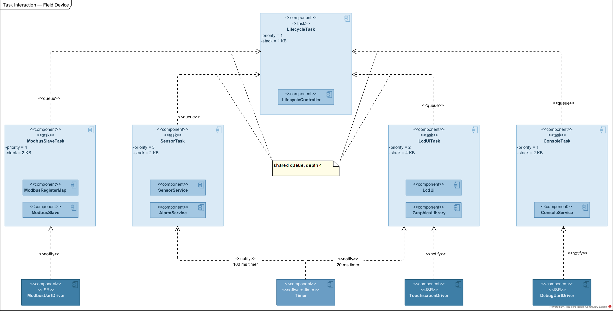
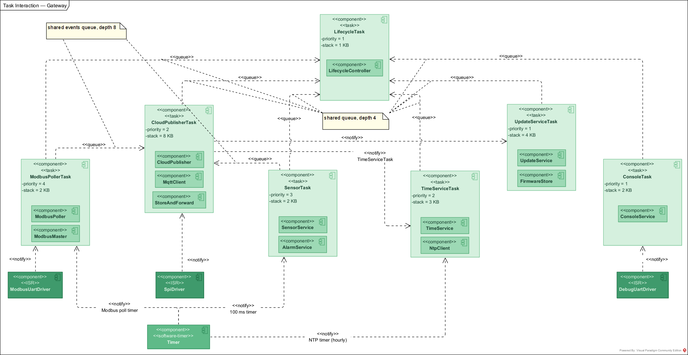

# High-Level Design — IoT Environmental Monitoring Gateway

**Version:** 0.7 (gate review remediation applied)
**Date:** May 2026
**Status:** In progress

---

## Contents

| § | Section |
|---|---------|
| 1 | Introduction |
| 2 | System context |
| 3 | System architecture — physical topology |
| 4 | Domain model |
| 5 | Component design — Field Device |
| 6 | Component design — Gateway |
| 7 | Behavioural design — state machines |
| 8 | Architectural patterns |
| 9 | Hardware abstraction strategy |
| 10 | Sequence diagrams |
| 11 | Task design |
| 12 | Modbus register map |
| 13 | Flash partition layout |
| 14 | Architectural decisions log |

## Revision history

| Version | Date | Summary of changes |
|---------|------|--------------------|
| 0.1 | Jan 2026 | Initial structure: introduction (§1), system context (§2), physical topology (§3) |
| 0.2 | Feb 2026 | Domain model (§4); Field Device and Gateway component views (§5–§6) |
| 0.3 | Mar 2026 | State machine designs (§7); architectural patterns and hardware abstraction strategy (§8–§9) |
| 0.4 | Mar 2026 | Sequence diagrams (§10); DeviceProfileRegistry introduced via §10.4 architectural feedback |
| 0.5 | Apr 2026 | FreeRTOS task design (§11); Modbus register map (§12); flash partition layout (§13) |
| 0.6 | May 2026 | Architectural decisions log (§14); artefact set complete; submitted for Phase 2→3 gate review |
| 0.7 | May 2026 | Gate review remediation: TOC, revision history, companion list, actor list, component counts, DeviceProfileRegistry in §6.1/§6.7, §7.6 FD Init fix, §9 virtual-hardware note, §10.4/§11.4 cross-ref fixes, §14.1 D## prefixes, duplicate removed, D21–D41 complete |

---

## 1. Introduction

### 1.1 Purpose

This document is the master High-Level Design for the IoT Environmental Monitoring Gateway. It consolidates the architectural decisions, structural views, and design patterns applied across both nodes of the system.

Where this document references detailed specifications, the source material is in companion files:

- `vision.md` — system concept, scope, success criteria.
- `SRS.md` — testable functional and non-functional requirements.
- `use-case-descriptions.md` — narrative of every actor-system interaction.
- `domain-model.md` — entity catalogue and relationships. *(companion in preparation)*
- `components.md` — full per-component responsibility and interface specification.
- `state-machines.md` — runtime state machines of both nodes, with full state lists, transition tables, and traceability.
- `sequence-diagrams.md` — 18 sequence diagrams with message tables and traceability.
- `task-breakdown.md` — FreeRTOS task design, IPC strategy, and schedulability check.
- `modbus-register-map.md` — full register-by-register specification, function code support, and test plan.
- `flash-partition-layout.md` — non-volatile memory layout for both boards.
- `architecture-principles.md` — numbered architectural principles (P1–P9) referenced throughout.
- `diagram-colour-palette.md` — colour conventions used across all UML diagrams.

### 1.2 How to read this document

Each architectural concern is presented through a *view* — a focused diagram answering one question. The document is layered: Section 2 sets the system context, Section 3 establishes the physical topology, Section 4 introduces the domain entities, Sections 5 and 6 decompose each node into software components, Section 7 describes the runtime behaviour through state machines, and Sections 8–9 explain the architectural patterns and hardware abstraction strategy that bind everything together. Section 10 presents the sequence diagrams and the architectural feedback they generated. Section 11 covers the FreeRTOS task design. Sections 12 and 13 specify the Modbus register map and flash partition layout respectively. Section 14 is the decisions log — every design choice made during the HLD phase, with rationale and the alternatives rejected.

The reader should expect to scroll through diagrams and prose in roughly equal measure. The diagrams anchor the structure; the prose carries the reasoning.

### 1.3 Methodology

The project follows a V-Model with model-based design. UML diagrams produced in Visual Paradigm are the authoritative design source; code is required to follow the model. Each artefact is traceable to the use case and requirement that motivated it.

The HLD phase consists of the following artefacts:

| # | Artefact | Status |
|---|----------|--------|
| 1 | System Deployment Diagram | Complete |
| 2 | Domain Model | Complete |
| 3 | Component Diagrams (per board, multi-view) | Complete |
| 4 | State Machine Diagrams | Complete |
| 5 | Sequence Diagrams | Complete |
| 6 | FreeRTOS Task Breakdown | Complete |
| 7 | Modbus Register Map | Complete |
| 8 | Flash Partition Layout | Complete |

This document is updated incrementally as each artefact is completed.

---

## 2. System context

The system addresses a recurring problem in industrial environmental monitoring: sensor data is captured at remote sites but is not visible until a technician visits, alarms go unnoticed, and configuration changes require a physical visit. The Vision document (`vision.md`) details the problem statement and stakeholder needs.

The system has three actors: a **Field Technician** physically present at the site performing installation, commissioning, and maintenance; a **Remote Operator** working through a cloud interface to monitor sensor data, configure thresholds, and issue commands; and **AWS IoT Core** (`«system»`), the cloud-side broker and rules engine that receives telemetry and delivers commands. These actors are defined in `vision.md` §4 and named consistently across all use cases in `use-case-descriptions.md`.

Twenty use cases are described in full in `use-case-descriptions.md`. They cluster into four concerns: data acquisition and display (UC-01 to UC-08), cloud communication (UC-05, UC-09 to UC-14), provisioning and diagnostics (UC-04, UC-15 to UC-17), and device lifecycle (UC-18 to UC-20).

---

## 3. System architecture — physical topology

The system is a two-node embedded network plus a cloud endpoint.

The **Field Device** (STM32F469 Discovery) acquires sensor readings, displays them locally on its LCD, and exposes them as Modbus RTU registers. It is a Modbus slave.

The **Gateway** (B-L475E-IOT01A) polls the field device over RS-485, aggregates the data with its own onboard sensors, and publishes telemetry to AWS IoT Core via MQTT over TLS. It is the Modbus master on the local fieldbus and the cloud-facing edge.

The two nodes are physically connected by a half-duplex RS-485 link carrying Modbus RTU. The Gateway maintains an outbound TLS-secured MQTT connection to AWS IoT Core via WiFi.

The deployment diagram also marks trust boundaries: the local fieldbus is one trust zone, the gateway-to-cloud path is another, separated by the WiFi/TLS authenticated connection. Trust boundaries reflect authentication mechanisms, not physical location.

---

## 4. Domain model

The domain model captures the conceptual entities that the software manipulates and the relationships between them. It is the noun catalogue of the system, deliberately divorced from any implementation concern.

Thirteen entities cover the operational domain: sensor data (`Sensor`, `SensorReading`, `MeasurementValue`), alarms (`Alarm`, `AlarmThreshold`), system state (`Device`, `DeviceHealthSnapshot`), persistence (`Configuration`, `LogEntry`, `BufferedRecord`), commands (`Command`), and cloud-bound payloads (`Telemetry`, `FirmwareImage`).

The `domain-model.md` companion document will explain each entity, the relationships and their multiplicities, and the modelling decisions taken — notably the composition of `SensorReading` from one to three `MeasurementValue` instances (cardinality-based variation), the denormalisation of `Alarm` (so historical accuracy survives reconfiguration), and the polymorphic-by-composition treatment of `BufferedRecord` (preserving each payload's structure without inheritance). *(Note: `domain-model.md` is in preparation. The entity narrative above is the authoritative summary until that companion is complete.)*

---

## 5. Component design — Field Device

The Field Device firmware decomposes into 25 software components across four layers: Application, Middleware, Driver, and Hardware (see §8.1 for the layered architecture definition). The full per-component specification is in `components.md`. This section presents the components through five focused views, each answering one architectural question *(D10)*.

### 5.1 Component overview

The Field Device hosts eight application components, five middleware components, and twelve drivers. The complete list, with use case ownership and interface contracts, is in `components.md`.

The application layer is dominated by data exposure (LcdUi for the screen, ModbusRegisterMap for the fieldbus, ConsoleService for the CLI) and data production (SensorService, AlarmService). It also includes `LifecycleController`, the explicit owner of the field-device top-level lifecycle state machine — coordinating Init sub-step sequencing, splash-screen progression, Operational ↔ EditingConfig transitions, and Faulted entry on unrecoverable conditions *(D11)*. The middleware layer hosts the protocol stack (ModbusSlave), the graphics library (LVGL), persistence (ConfigStore), and cross-cutting services (Logger, TimeProvider). The driver layer is direct register access via CMSIS, with two drivers — BarometerDriver and HumidityTempDriver — implemented in software per Vision §5.1.1 (the field device simulates its sensors).

### 5.2 Data flow view

This view answers: *how does sensor data reach the LCD and the Modbus register table?*

Sensor data flows upward through the SensorService, which exposes the latest validated readings via `ISensorService`. Two consumers — LcdUi (for display) and ModbusRegisterMap (for register exposure) — pull data through this interface. The reading is timestamped via TimeProvider, which encapsulates the synchronisation-state flag mandated by Vision §8. AlarmService subscribes to SensorService's new-reading events and evaluates each reading against configured thresholds; the resulting alarm state is consumed by both LcdUi and ModbusRegisterMap.

The Modbus path runs from ModbusRegisterMap down through ModbusSlave (the protocol stack) to ModbusUartDriver. The LCD path runs from LcdUi through the GraphicsLibrary middleware (LVGL) down to LcdDriver and TouchscreenDriver. The CLI path runs from ConsoleService directly to DebugUartDriver.

### 5.3 Sensor and alarm pipeline view

This view answers: *how is alarm evaluation wired and where do thresholds come from?*

The sensor pipeline at the application level is event-driven. SensorService produces readings periodically, applies range validation (REQ-SA-120) and signal conditioning (REQ-SA-130, REQ-SA-140), and emits new-reading events to subscribers. AlarmService subscribes, reads thresholds and hysteresis settings from `IConfigProvider` (the read-side of ConfigService), and notifies its own subscribers when alarm state transitions occur *(D7)*.

The driver-level acquisition path is shown on the data flow view; this view abstracts it away to keep focus on the alarm evaluation logic.

### 5.4 System diagnostic and traceability view

This view answers: *how is logging wired across the system?*

Logger is a cross-cutting middleware service consumed by every Application and Middleware component for diagnostic output (REQ-NF-500). Drawing every Logger consumer connection on the other views would render them unreadable; the convention is to elide Logger from those views and document its consumers here.

Logger uses RtcDriver directly to obtain timestamps, bypassing TimeProvider *(D8)*. This is a documented bootstrap exception: TimeProvider depends on Logger (it logs sync errors), so Logger cannot also depend on TimeProvider without creating a circular dependency.

### 5.5 System health and telemetry pipeline view

This view answers: *how do health metrics flow from producers to displays?*

HealthMonitor is a passive collector at the application level. It exposes two interfaces: `IHealthSnapshot` (read-side, consumed by LcdUi, ConsoleService, and ModbusRegisterMap which exports it via Modbus to the Gateway) and `IHealthReport` (write-side, consumed by metric producers) *(D2)*.

Producers fall into two categories. Application-layer producers (SensorService, ModbusRegisterMap, ConfigService, etc.) push metrics directly. Middleware producers participate via the Metric Producer Pattern (see §8.4): ModbusSlave exposes `IModbusSlaveStats` for accumulated counters (CRC errors, timeouts, transaction counts), polled by ModbusRegisterMap and reported upward *(D4)*; TimeProvider, ConfigStore, and similar middleware components depend on `IHealthReport` for event-based metrics (sync state changes, persistence failures). The DIP relationship (see §8.3) — `IHealthReport` owned by HealthMonitor (Application) but consumed by Middleware — is what preserves layering despite the bottom-up data flow *(D3)*.

HealthMonitor also drives the on-board LEDs to indicate device status (idle, acquiring, alarm, error).

### 5.6 Configuration and persistence view

This view answers: *how do parameter changes propagate from input to flash?*

ConfigService applies Interface Segregation *(D1)*: writers consume `IConfigManager` (LcdUi, ConsoleService, ModbusRegisterMap for incoming writes from the Gateway), readers consume `IConfigProvider` (SensorService, AlarmService, ModbusRegisterMap for outgoing register exposure). Writes are validated, applied to in-memory state, and persisted via ConfigStore. ConfigStore wraps QspiFlashDriver and handles the wear-levelling and atomic-update concerns that belong in a persistence library, not in the application.

---

## 6. Component design — Gateway

The Gateway firmware decomposes into 34 software components: twelve application, eight middleware, fourteen drivers. It is more diverse than the Field Device because of its dual role as fieldbus master and cloud-facing edge.

### 6.1 Component overview

The application layer hosts the cloud-facing components (CloudPublisher, StoreAndForward), the fieldbus orchestrator (ModbusPoller), the time service (TimeService), the firmware update orchestrator (UpdateService), the device profile registry (DeviceProfileRegistry), plus the same set of services found on the Field Device (HealthMonitor, SensorService, AlarmService, ConsoleService, ConfigService). The application layer also hosts `LifecycleController`, which owns the gateway top-level lifecycle — coordinating Init sub-steps, the restart-confirmation flow (UC-17), the firmware update handoff to UpdateService (UC-18), and Faulted entry on unrecoverable conditions *(D11)*.

The middleware layer adds the cloud and time protocols (MqttClient, NtpClient), the ring-buffer log over flash (CircularFlashLog), the firmware image manager (FirmwareStore), and the Modbus master stack (ModbusMaster). Logger, TimeProvider, and ConfigStore are present as on the Field Device. The middleware layer thus counts eight components in total.

The driver layer adds WiFi (over SPI) and the WiFi module's GPIO control lines, plus a software-reset driver used by the firmware update flow.

### 6.2 Data flow view

This view answers: *how does sensor data — both gateway-local and field-device-relayed — reach the cloud?*

CloudPublisher is the central application component. It draws sensor data from two sources — the Gateway's own SensorService and the field device's data relayed by ModbusPoller — and publishes both via MqttClient, which sits on top of the WiFi driver. When the cloud is unreachable, CloudPublisher diverts payloads to StoreAndForward, which buffers them in CircularFlashLog over QspiFlashDriver until connectivity is restored.

The Gateway's own sensor pipeline mirrors the Field Device pattern: SensorService polls the four onboard sensors via I2C and timestamps readings via TimeProvider. The Modbus master pipeline (ModbusPoller → ModbusMaster → ModbusUartDriver) parallels it, with CloudPublisher consuming both via the respective interfaces.

### 6.3 Cloud publishing and resilience view

This view answers: *how does the Gateway behave when the cloud is unreachable, and how is firmware updated?*

The cloud path runs from CloudPublisher through MqttClient and WifiDriver. MqttClient maintains the TLS-secured connection and exposes connection state to its consumer.

When MQTT publish fails (connection lost, broker unreachable), CloudPublisher routes payloads into StoreAndForward, which appends them to CircularFlashLog. CircularFlashLog implements a chronological append-and-consume log over flash sectors, overwriting the oldest records when full. On reconnection, StoreAndForward replays buffered records in order.

UpdateService orchestrates firmware updates per UC-18. It downloads the new image via MqttClient and delegates storage and signature verification (REQ-DM-070) to FirmwareStore, a middleware component that owns flash partition management *(D9)*. After verification succeeds, UpdateService commits the slot switch via FirmwareStore and triggers a reboot via ResetDriver. Separating image management (middleware) from update orchestration (application) keeps each concern testable in isolation.

### 6.4 System diagnostic and traceability view

The same Logger pattern as the Field Device, applied to the Gateway's larger component set. Every Application and Middleware component depends on `ILogger`. Logger writes to DebugUartDriver and timestamps from RtcDriver (bootstrap exception).

### 6.5 Sensor and alarm pipeline view

The Gateway evaluates alarms only on its own sensor data. Field-device alarms arrive pre-evaluated via Modbus and are relayed by ModbusPoller as state-change events to CloudPublisher; they are not re-evaluated by the Gateway's AlarmService. This avoids double evaluation and respects the field device as the authority on its own measurements.

### 6.6 System health and telemetry pipeline view

Same DIP (see §8.3) and Metric Producer Pattern (see §8.4) as on the Field Device, with more producers *(D2, D3, D4)*. ModbusMaster exposes `IModbusMasterStats` (polled by ModbusPoller); MqttClient exposes `IMqttStats` (polled by CloudPublisher). The middleware event-pushers — TimeProvider, ConfigStore, NtpClient, CircularFlashLog — depend on `IHealthReport` directly. CloudPublisher both reads `IHealthSnapshot` (to publish health telemetry) and reports its own MQTT metrics via `IHealthReport`.

### 6.7 Configuration and persistence view

The same ConfigService split as on the Field Device *(D1)*. Writers (ConsoleService, CloudPublisher when receiving remote configuration commands) consume `IConfigManager`. Readers (SensorService, AlarmService, ModbusPoller) consume `IConfigProvider`. Persistence flows through ConfigStore to QspiFlashDriver. `DeviceProfileRegistry` also participates in this view: it exposes `IDeviceProfileManager` (write-side, for profile provisioning via ConsoleService or remote configuration) and `IDeviceProfileProvider` (read-side, consumed by ModbusPoller for the polling allowlist). Device profile persistence is delegated to ConfigStore, so profiles survive reboot without a separate flash partition *(D18)*.

---

## 7. Behavioural design — state machines

The component design in Sections 5 and 6 establishes *what exists*. This section establishes *how the system behaves over time*: the runtime modes each subsystem goes through, the events that drive transitions, and the actions performed at each step. Six state machines capture the substantive lifecycle logic in the system; each is owned by a specific component and traces back to use cases and SRS requirements.

The full state lists, transition tables, internal-transition tables, and traceability matrices are in `state-machines.md`. This section presents each machine with its diagram and a summary paragraph; the companion document is the source of truth for state-by-state detail.

### 7.1 Inventory and ownership

| #   | Machine                       | Owner component                                                                                | Board         |
|-----|-------------------------------|------------------------------------------------------------------------------------------------|---------------|
| 1   | Gateway Lifecycle             | `LifecycleController` (Application)                                                            | Gateway       |
| 2   | Cloud Connectivity            | `CloudPublisher` (Application)                                                                 | Gateway       |
| 3   | Firmware Update               | `UpdateService` (Application)                                                                  | Gateway       |
| 4   | Modbus Master                 | `ModbusPoller` (Application; protocol-level frame handling delegated to `ModbusMaster` Middleware) | Gateway       |
| 5   | Field Device Lifecycle        | `LifecycleController` (Application)                                                            | Field Device  |
| 6   | Modbus Slave                  | `ModbusSlave` (Middleware)                                                                     | Field Device  |

A seventh candidate — a per-channel alarm state machine (Clear ↔ Active with hysteresis) — is deliberately deferred to LLD. It is per-instance rather than per-system, the states are trivial (Clear, Active) with a single guarded transition pair, and including it at HLD level would clutter without adding clarity.

State machine diagrams in this project show **structural transitions only** *(SM-1)*. Internal transitions, entry / do / exit actions, and other behavioural compartments are listed in `state-machines.md`, not on the diagrams. The diagrams answer *"what states exist and how do they connect?"*; the companion document answers *"what does each state actually do?"*. Separating the two keeps the diagrams readable and the behavioural specification authoritative in one place.

### 7.2 Gateway lifecycle

The richest top-level machine in the system. Six top-level states (Init, Operational, EditingConfig, Restarting, UpdatingFirmware, Faulted) plus a five-step composite Init (CheckingIntegrity → LoadingConfig → BringingUpSensors → StartingMiddleware → SelfChecking). Twenty-one state transitions and fifteen internal transitions handle the full operational lifecycle including remote restart with confirmation (UC-17), firmware update handoff (UC-18), CLI provisioning, and unrecoverable-fault entry.

A key architectural decision is encoded here: the gateway lifecycle has no "Degraded" state, even though cloud connectivity may be lost at runtime *(D12)*. Per REQ-NF-200, cloud loss does not change the gateway's top-level mode — it only changes the Cloud Connectivity sub-machine's state (§7.3). Surfacing the distinction here would duplicate logic the sub-machine already owns. EditingConfig is promoted to a top-level state rather than an Operational sub-state because it carries a distinct exit timeout, snapshot/rollback semantics, and a cross-machine event (`internet_params_changed`) that triggers Cloud Connectivity to reconnect with new credentials *(SM-2)*.

### 7.3 Cloud connectivity (sub-machine)

Owned by `CloudPublisher`. Models the gateway's relationship with AWS IoT Core: connect, publish, lose connection, reconnect, drain buffer. Three top-level states (Connecting, Connected — composite with Draining and Publishing sub-states, Disconnected) plus a choice pseudo-state at entry to Connected that picks the initial sub-state based on buffer occupancy.

The store-and-forward semantics mandated by REQ-BF-000, -010, -020 are encoded as internal transitions: Disconnected enqueues new outbound messages and drops oldest when the buffer fills; Connected.Draining publishes buffered messages chronologically; Connected.Publishing forwards live messages directly to MQTT. Reconnect attempts at 1 Hz (REQ-NF-209) are driven by a timer in Disconnected. The boundary transition from Connected to Disconnected uses `internet_params_changed` to handle credential changes from the gateway lifecycle's EditingConfig path.

### 7.4 Firmware update (sub-machine)

Owned by `UpdateService`. The most state-rich machine in the system, spanning up to two MCU reboots. Eight states (Idle, Downloading, Validating, Applying, SelfChecking, RollingBack, Committed, Failed) with the dual-bank update sequence: download to inactive bank → verify signature and integrity → set inactive bank as boot → reboot → self-check in new firmware → commit or roll back.

Reboots are not states. They are **transition actions** (`NVIC_SystemReset()`) *(SM-4)* followed by flag-driven resume on the next boot: gateway-lifecycle Init detects `pending_self_check` or `pending_rollback` and resumes this machine in the appropriate state via the entry-point pseudo-state shown on the diagram. A choice diamond branches on which flag is set, with a UML note documenting that this entry path fires only on the post-update boot — otherwise the machine remains in Idle across the reboot.

### 7.5 Modbus master (sub-machine)

Owned by `ModbusPoller` (with protocol-level frame handling delegated to the `ModbusMaster` Middleware library). Active machine: drives transitions via internal timers. Four states (Idle, Transmitting, AwaitingResponse, ProcessingResponse) with the canonical Modbus polling cycle: send request, wait for response with 200 ms timeout (REQ-MB-050), retry up to three times on timeout (REQ-MB-060), record poll outcome.

Link-state hysteresis (REQ-NF-103, NF-104, NF-215) — declaring the Modbus link offline after three consecutive failed polls and online after three consecutive successful polls — is modelled as transition actions on a `link_state` model variable, not as separate states *(SM-3)*. The yellow note on the diagram documents the hysteresis pseudocode. An alternative HSM with Online and Offline as composite states each containing the same polling sub-states was considered and rejected as visually redundant.

### 7.6 Field device lifecycle

Simpler than the gateway: no cloud, no firmware update, no remote restart. Four top-level states (Init, Operational, EditingConfig, Faulted) plus a five-step composite Init (CheckingIntegrity → LoadingConfig → BringingUpSensors → BringingUpLCD → StartingMiddleware). Note the differences from the gateway Init: the FD adds `BringingUpLCD` between `BringingUpSensors` and `StartingMiddleware`; it omits `SelfChecking` entirely because there is no post-update self-check on the FD (UC-17 is gateway-only and the FD has no OTA). The LCD brings-up step is essential per REQ-LD-000 *(SM-8)*.

The field device's complexity lives mostly *inside* Operational rather than *across* states: ten internal transitions handle sensor polling, LCD refresh, alarm evaluation, Modbus register updates, time-push reception, on-demand reads, and CLI diagnostics. Like the gateway, EditingConfig is a top-level state rather than an Operational sub-state, with a cross-machine `modbus_address_changed` event that updates the Modbus Slave's address filter on apply.

### 7.7 Modbus slave (sub-machine)

Owned by `ModbusSlave` Middleware. **Reactive machine — no timers, no retries, no polling.** Frame reception drives every transition. Three states (Idle, ProcessingRequest, Responding) with the smallest transition table in the system: five state transitions, two internal transitions.

The contrast with the Modbus Master diagram (§7.5) is the point: the master has timeouts, retries, and link-state hysteresis; the slave has none of these. A bad frame is silently dropped; the slave returns to Idle ready for the next frame. REQ-MB-050 (200 ms timeout), REQ-MB-060 (3-retry), REQ-NF-103 / NF-104 (link-state hysteresis) are all explicitly master-side concerns. The yellow note on the diagram makes this asymmetry explicit so that absence of timer/retry logic reads as deliberate, not as an omission.

### 7.8 Cross-machine relationships

The six machines couple at runtime through clearly named events that cross machine boundaries:

- **Gateway lifecycle ↔ Cloud Connectivity** — Init triggers Cloud Connectivity start (REQ-CC-050); thereafter independent (REQ-NF-200).
- **Gateway lifecycle ↔ Firmware Update** — `UpdatingFirmware` composite delegates via `«submachine»` stereotype; `update_done` returns control via three guarded transitions (success / rollback OK / unrecoverable). The Apply→reboot→SelfChecking and RollingBack→reboot→Failed reboot chains both cross gateway-lifecycle Init via persisted flags.
- **Gateway lifecycle ↔ Modbus Master** — Init starts the master; Modbus failures surface via `node_offline` event consumed by HealthMonitor / CloudPublisher, never changing gateway top-level state.
- **Gateway EditingConfig → Cloud Connectivity** — on apply, emits `internet_params_changed`; Cloud Connectivity force-disconnects and reconnects with new credentials.
- **Field Device lifecycle ↔ Modbus Slave** — Init brings up the slave; thereafter the slave runs autonomously. Time-push frames received by the slave (REQ-MB-020) emit `modbus_time_push_received`, consumed by Operational's RTC sync internal transition.
- **Field Device EditingConfig → Modbus Slave** — on Modbus-address change, emits `modbus_address_changed`; the slave updates its address filter without restarting.
- **Modbus Master (gateway) ↔ Modbus Slave (field device)** — RS-485 half-duplex over UART. The two machines never see each other's internal state — only frames on the bus and the cause/effect they imply.

`state-machines.md` §Cross-machine relationships tabulates these couplings in full. Sequence diagrams in HLD Artefact #5 will illustrate the same interactions concretely along the time axis.

---

## 8. Architectural patterns

The design draws on a small number of patterns. Each is applied to solve a concrete problem; none is decoration.

### 8.1 Layered architecture with strict directional dependency

The system has four layers: Application → Middleware → Driver → Hardware. Each layer depends only on layers below it. This is the foundation of the design.

When bottom-up data flow is required (Middleware reporting health metrics to an Application aggregator), Dependency Inversion is applied — the lower layer depends on an abstraction owned by the upper layer, never on the upper-layer implementation.

This pattern is universal in professional embedded codebases: AUTOSAR, Zephyr, FreeRTOS-based systems, MISRA-compliant automotive firmware. It is the floor, not the ceiling.

### 8.2 Interface Segregation Principle (ISP)

When a component has consumers with different needs, the component exposes multiple narrow interfaces rather than one fat interface.

- ConfigService provides `IConfigManager` (write-side) and `IConfigProvider` (read-side). Writers and readers depend only on what they use.
- HealthMonitor provides `IHealthSnapshot` (read-side) and `IHealthReport` (write-side). Readers and producers see different surfaces.

ISP reduces coupling, simplifies testing (mock only the interface used), and makes architectural intent explicit. It is a core SOLID principle and standard in shipping commercial firmware.

### 8.3 Dependency Inversion Principle (DIP)

When an upper layer must receive data from a lower layer at runtime — for example, Middleware producers reporting metrics to an Application HealthMonitor — the upper layer defines the abstraction. The lower layer depends on the abstraction, never on the implementation.

In this project, `IHealthReport` is owned by HealthMonitor (Application) but consumed by middleware producers (TimeProvider, ConfigStore, NtpClient, CircularFlashLog). Middleware sees only the abstraction; the layering rule is preserved because dependency points at an interface, not at HealthMonitor itself.

The visual convention in the component diagrams: the abstraction ball is attached to the implementing upper-layer component; lower-layer consumers reach upward with sockets. This is standard component-diagram notation for DIP — the inversion is conceptual, not geometric.

DIP appears in Zephyr's logging backends, AUTOSAR's Diagnostic Event Manager, and C++ IoC-style frameworks throughout embedded.

### 8.4 Metric Producer Pattern

Two mechanisms are used for health metric flow, chosen by metric type:

- **Stats polling** via `IXxxStats`: for accumulated counters (CRC error counts, transaction counts, reconnection counts). Middleware exposes the stats interface; an Application consumer polls and reports through `IHealthReport`. Examples: `IModbusSlaveStats`, `IModbusMasterStats`, `IMqttStats`.
- **Direct push** via `IHealthReport`: for event-based signals (sync state change, persistence failure, NTP query failure). The producer pushes when the event occurs.

The test: *is this a counter I want to read at any sample time, or an event I need to report when it happens?* Counters → poll. Events → push.

This mixed approach matches industry convention. lwIP exposes statistics through a query API and reports events through callbacks; FreeRTOS+TCP and Zephyr's network subsystem use the same pattern.

### 8.5 Observer (event-driven subscription)

SensorService emits new-reading events. AlarmService subscribes. Each new reading triggers immediate alarm evaluation, satisfying REQ-NF-101 (one-polling-cycle alarm detection) without polling *(D7)*.

This avoids two failure modes of polling: alarm detection latency (waiting for the polling tick) and double polling (SensorService produces, AlarmService polls, the rates rarely align).

### 8.6 Mediator

ModbusRegisterMap mediates between ConfigService (the configuration source) and ModbusSlave (the protocol stack) *(D5)*. When a Modbus master writes to a configuration register, the write reaches ModbusSlave first; ModbusRegisterMap dispatches it to ConfigService for validation and application. When configuration changes affect protocol behaviour (slave address, baud rate), ModbusRegisterMap reads from ConfigService and pushes to ModbusSlave.

This keeps ModbusSlave ignorant of project-specific configuration, allowing the protocol stack to remain a reusable middleware component.

### 8.7 Pull-based access

When a producer feeds multiple consumers, prefer a pull interface (consumers query for data) over push (producer notifies each consumer). Producers stay unaware of consumers *(D6)*.

SensorService exposes `ISensorService.get_latest()`. LcdUi, ModbusRegisterMap, ConsoleService, AlarmService all consume the same interface. SensorService adds or removes nothing when consumers change.

The exception is when a consumer's responsiveness requirement is tighter than the producer's natural rate — then event subscription (Observer) applies, as in the SensorService → AlarmService relationship.

### 8.8 Store-and-Forward

Telemetry destined for an unreliable cloud must survive connectivity loss. CloudPublisher routes payloads to MqttClient when online; when offline, it diverts to StoreAndForward, which persists records in a circular log over flash. On reconnection, the log is drained in chronological order.

This is the standard industrial-IoT resilience pattern. AWS IoT Greengrass, Azure IoT Edge, Siemens MindSphere, and HMS Networks Anybus all use this exact structure.

### 8.9 State machines as behavioural backbone

Per Section 7, six explicit state machines own the substantive lifecycle logic in the system. The pattern is consistent: each machine has exactly one owner component (visible in `components.md`), each state and transition traces to ≥ 1 SRS requirement or use case, and behavioural detail (entry / do / exit, internal transitions) is specified textually in `state-machines.md` rather than crammed onto the diagram.

The pattern of a single `LifecycleController` Application component owning each board's top-level lifecycle is deliberate: lifecycle is a coordination concern distinct from the functional decomposition of Sections 5 and 6, and an explicit owner makes it traceable in the same way SensorService is the owner of sensor acquisition. Without an explicit owner, the lifecycle would be implicit in `main.c` startup code — defensible but harder to defend in interview review.

---

## 9. Hardware abstraction strategy

Vision §9 establishes the portability stance: no STM32 HAL above the driver layer; CMSIS-only inside drivers. This section explains how each driver realises that stance.

The drivers fall into three categories:

| Driver | Approach | Rationale |
|--------|----------|-----------|
| **DebugUartDriver** | CMSIS register-level | UART configuration is straightforward at the register level. Demonstrates competence with peripheral programming without reinventing complex flow. |
| **ModbusUartDriver** | CMSIS register-level | Same reasoning as DebugUartDriver, with additional DMA configuration for half-duplex RS-485 timing. |
| **I2cDriver** | CMSIS register-level | I2C state machine is a classic embedded driver exercise. Implementing it directly demonstrates protocol understanding. |
| **SpiDriver** *(Gateway)* | CMSIS register-level | Same reasoning as I2C. Used by WifiDriver. |
| **GpioDriver** | CMSIS register-level | GPIO is the simplest peripheral. HAL would be overhead. |
| **LedDriver** | Wraps GpioDriver | One level above GPIO; provides on/off semantics. |
| **RtcDriver** | CMSIS register-level | RTC is a self-contained backup-domain peripheral; HAL adds no value. |
| **ResetDriver** *(Gateway)* | CMSIS (NVIC_SystemReset) | One-line implementation. Wrapping `NVIC_SystemReset()` would be ceremony without substance. |
| **SdramDriver** *(Field)* | CMSIS register-level | FMC controller initialisation. Complex but well-documented in the reference manual. |
| **QspiFlashDriver** | CMSIS register-level | QSPI controller programming is non-trivial but isolated to one driver. |
| **LcdDriver** *(Field)* | CMSIS register-level + framebuffer in SDRAM | DSI controller programming. Framebuffer location handled via SdramDriver. |
| **TouchscreenDriver** *(Field)* | Wraps I2cDriver | I2C transactions to the touchscreen controller; no special HAL feature. |
| **WifiDriver** *(Gateway)* | AT-command implementation over SPI | Inventek ISM43362 module is controlled via AT commands. No HAL involvement. |
| **Sensor drivers** *(Gateway sensors)* | Wraps I2cDriver | Each sensor (Magnetometer, IMU, Barometer, Humidity/Temp) is an I2C device with a register map. The driver translates between sensor-specific protocol and the generic `IXxx` interface. |
| **Sensor drivers** *(Field Device)* | Software simulation | Per Vision §5.1.1, the Field Device simulates its sensors. The drivers expose the same interfaces (`IBarometer`, `IHumidityTemp`) as the Gateway equivalents, so the application layer is unaware of the difference. |

The result: every peripheral access in the system is direct CMSIS code. No vendor library is imported above the driver layer. The interfaces consumed by Middleware and Application are vendor-neutral by construction.

Vision §9 uses the term "virtual hardware layer" for this boundary. In this design, there is no separate fifth layer: the "virtual hardware layer" of Vision §9 is realised by the upward `IXxx` ports that each driver exposes. These interfaces are owned by the consuming Middleware or Application component (per DIP, §8.3), not by the driver itself. No additional abstraction layer is interposed between Driver and Middleware. The four-layer model of §8.1 is therefore complete and correct.

For middleware that wraps a third-party library, the same boundary discipline applies. GraphicsLibrary on the Field Device wraps LVGL — a vendor-neutral, MIT-licensed C graphics library — and exposes `IGraphics` upward. LVGL is preferred over TouchGFX because TouchGFX's tooling assumes STM32CubeMX integration, conflicting with the portability stance.

The Modbus protocol stack on both boards is implemented from scratch, not wrapped from FreeMODBUS or a vendor SDK *(SM-5)*. This decision is recorded in §14 with rationale.

---
## 10. Sequence diagrams

### 10.1 Purpose and scope

Where Section 7 specifies *what state* each subsystem is in, this section
specifies *who calls whom* during each significant flow — the same runtime
behaviour seen from a different projection.

The full set of 18 sequence diagrams, message-by-message tables, fragment
decisions, and traceability is in the companion document `sequence-diagrams.md`.
This master HLD presents the inventory and the verification outcomes; the
companion is the source of truth for content.

Sequence diagrams serve a dual purpose. First, they document the API-level
interactions that the LLD refines into per-task sequencing and IPC choices.
Second, they act as a verification pass on the structural design — if a flow
cannot be drawn cleanly with the existing components, that exposes a gap in the
component spec or state machines. Several such gaps were exposed and resolved
during this phase; they are summarised in §10.4 and recorded in §12.

### 10.2 Drawing conventions

The conventions used across all sequence diagrams are documented in
`sequence-diagrams.md` §2. The conventions material to this overview:

- Synchronous calls use solid arrows with filled arrowheads; async events use
  open arrowheads. Returns are shown only where the return value is used by
  the caller.
- Boundary actors (`«cloud»` AWS IoT Core, `«bootloader»` STM32 bootloader)
  mark the system boundary; their internal logic is out of HLD scope.
- Pull-based downstream consumption (P7) is annotated by UML notes rather than
  redrawn on every consumer *(D19)*.
- Each diagram is accompanied by a numbered message table; the diagram and
  table are kept synchronised by review. **The table is the contract.**

### 10.3 Diagram inventory

The 18 diagrams are grouped by lifecycle phase. Each entry below shows the
diagram and a one-line summary; the message table, fragment list, and
traceability are in `sequence-diagrams.md`.

#### Boot and link establishment

**SD-00a — Field device cold boot**

Power-on through `LifecycleController` Init composite to Operational; LCD
splash with progress bar (REQ-LD-200..-240).

**SD-00b — Gateway cold boot and Modbus link establishment**

Gateway Init through self-check, including per-slave probe with
profile-bound device-ID validation (D14, D17).

**SD-00c — Gateway post-update boot**

Boot-time detection of `pending_self_check` flag and entry into the Firmware
Update sub-machine at SelfChecking.

#### Runtime steady state

**SD-01 — Sensor acquisition cycle** *(UC-07)*

Periodic `SensorService` poll, threshold evaluation, and pull-based exposure
of the latest reading to downstream consumers.

**SD-02 — Modbus polling cycle** *(UC-10)*

`ModbusPoller` issues a request to a profiled slave, with timeout (REQ-MB-050)
and retry (REQ-MB-060) handling. Link-state hysteresis is recorded as a
transition action.

**SD-03a — Cloud telemetry publish** *(UC-05)*

`CloudPublisher` assembles a telemetry payload and publishes via `MqttClient`
through `WifiDriver`.

**SD-03b — Cloud health publish** *(UC-06)*

Periodic health snapshot (`IHealthSnapshot`) published on a separate MQTT topic.

#### Exception flows

**SD-04a — Disconnect and buffering** *(UC-11, UC-12 entry)*

Cloud Connectivity transitions to Disconnected; outbound messages are
enqueued; oldest dropped on overflow (REQ-BF-000..-020).

**SD-04b — Reconnect and drain** *(UC-11, UC-12 recovery)*

Reconnect attempt succeeds; choice pseudo-state routes to Draining;
chronological replay of buffered messages.

**SD-05 — Alarm propagation** *(UC-08, UC-09)*

Threshold breach in `SensorService` propagates as an Observer event to
`AlarmService`, then to `CloudPublisher` and LCD (REQ-NF-101 latency budget).

#### Firmware update *(UC-18)*

**SD-06a — OTA initiation**

Cloud command received; `UpdateService` validates and authorises the update;
download begins to the inactive bank.

**SD-06b — OTA download and verification**

Streamed image written to inactive bank via `FirmwareStore`; signature and
integrity verified.

**SD-06c — Bank swap and reboot**

Boot pointer flipped, `pending_self_check` flag set, `NVIC_SystemReset()`
fires. Reboot is a transition action, not a state.

**SD-06d — Self-check, commit or rollback**

Three serial probes — sensor, Modbus, MQTT — within REQ-NF-204's 10 s
budget; commit on success, rollback on any failure (D15).

#### Remote management

**SD-07 — Remote configuration command** *(UC-15, UC-19)*

Cloud configuration command received, validated, applied via `IConfigManager`,
and acknowledged. Configuration drift handled by snapshot/rollback semantics.

**SD-08 — Remote restart** *(UC-17)*

Cloud restart command received; gateway lifecycle transitions to Restarting;
confirmation published before reset.

#### Cross-cutting

**SD-09 — Time synchronisation** *(UC-13)*

`TimeService` performs NTP sync at boot and on post-reconnect trigger from
`CloudPublisher` (D13).

**SD-10 — Device provisioning** *(UC-16)*

CLI provisioning of credentials, device profiles, and threshold configuration
through `ConsoleService` and `ConfigService`.

### 10.4 Architectural feedback from this phase

Drawing the sequence diagrams surfaced four substantive issues that fed back
into the structural design. Each is recorded in §14.

1. **Per-slave link state with profile binding.** SD-02 could not represent
   multi-slave allowlist behaviour (REQ-MB-100) without a registry of known
   device profiles. This led to introducing a `DeviceProfileRegistry`
   Application component on the gateway, with an `IDeviceProfileProvider`
   interface and persistence delegated to `ConfigStore`. Component spec and
   supporting SRS requirements (REQ-MB-110, REQ-MB-111, REQ-MB-120,
   REQ-MB-130, REQ-DM-100, REQ-DM-101) land in follow-up PRs *(D17, D18)*.

2. **Periodic re-sync trigger ownership.** SD-09 required a triggering
   component external to `TimeService` for the post-reconnect NTP retry path.
   `CloudPublisher` already owns connectivity-state propagation and was
   assigned the trigger role *(D13)*. The trigger is drawn as a terminal
   async event on `TimeService`; the companion document carries the semantic
   that it re-enters the sync flow.

3. **Self-check probe coordination (SD-06d).** Initial draft used a `par`
   fragment for sensor / Modbus / MQTT probes. Analysis showed that with
   three probes and the 10 s budget of REQ-NF-204, serial probes complete in
   roughly 500 ms — well inside the budget — and avoid the coordination
   primitives (event group / counting semaphore) that the parallel form
   would require. Serial dispatch was adopted *(D15)*.

4. **Bootloader as boundary actor.** Firmware-update sequences (SD-06a–d)
   cross into bootloader territory at each reboot. Treating the bootloader
   as a `«bootloader»` boundary actor — analogous to `«cloud»` — keeps its
   internal logic out of the HLD without losing the cross-domain handoff
   *(D16)*.

### 10.5 LLD handoff

The sequence diagrams establish the message-level contract between
components *(D20)*. The LLD refines them into:

- **Per-task sequencing** — which FreeRTOS task runs which segment of each
  flow.
- **IPC mechanism** — which messages traverse a queue, a direct task
  notification, an event group, or a direct call within the same task.
- **Per-message timing budget** — fragment-level latency contributions to
  the SRS NF deadlines.

HLD Artefact #6 (RTOS Task Breakdown) is the bridge from sequence diagrams
to LLD task design.
---

## 11. Task design

### 11.1 Purpose and scope

The component view (§5–6) defines who exists. The sequence diagrams (§10)
define who calls whom over time. This section defines the runtime
execution structure: which FreeRTOS task hosts which components, at what
priority, with what stack, and through which IPC primitive.

The full task tables, ISR contracts, mutex strategy, schedulability
check, and engineering method are in the companion document
`task-breakdown.md`. This section presents the summary and embeds the two
task interaction diagrams.

### 11.2 Task interaction diagrams

**Field Device** — five application tasks plus idle and timer.

**Gateway** — seven application tasks plus idle and timer.

Conventions: `«task»` stereotype on each task element; hosted components
nested inside; ISRs at diagram edge with `«ISR»` stereotype; IPC
connectors stereotyped `«notify»` / `«queue»` / `«mutex»` etc.

### 11.3 Task summary

**Field Device (5 tasks)**

| Task | Hosted | Priority | Stack |
|---|---|---|---|
| `ModbusSlaveTask` | `ModbusRegisterMap`, `ModbusSlave` | 4 | 2 KB |
| `SensorTask` | `SensorService`, `AlarmService` | 3 | 2 KB |
| `LcdUiTask` | `LcdUi`, `GraphicsLibrary` | 2 | 4 KB |
| `ConsoleTask` | `ConsoleService` | 1 | 2 KB |
| `LifecycleTask` | `LifecycleController` | 1 | 1 KB |

**Gateway (7 tasks)**

| Task | Hosted | Priority | Stack |
|---|---|---|---|
| `ModbusPollerTask` | `ModbusPoller`, `ModbusMaster` | 4 | 2 KB |
| `SensorTask` | `SensorService`, `AlarmService` | 3 | 2 KB |
| `CloudPublisherTask` | `CloudPublisher`, `MqttClient`, `StoreAndForward` | 2 | 8 KB |
| `TimeServiceTask` | `TimeService`, `NtpClient` | 2 | 3 KB |
| `UpdateServiceTask` | `UpdateService`, `FirmwareStore` | 1 | 4 KB |
| `ConsoleTask` | `ConsoleService` | 1 | 2 KB |
| `LifecycleTask` | `LifecycleController` | 1 | 1 KB |

Stack sizes are conservative initial estimates; refined via
`uxTaskGetStackHighWaterMark()` during integration *(D28)*.

### 11.4 Architectural feedback from this phase

Designing the task layout surfaced several decisions worth highlighting.
The full set is recorded in §14.

1. **`AlarmService` co-located with `SensorService`** in `SensorTask` —
   Observer subscriber runs in producer's task context; the extra queue
   and context switch is unjustified by REQ-NF-101 *(D21)*.

2. **`TimeService` and `CloudPublisher` kept in separate tasks** despite
   shared WiFi resource — different activation patterns (hourly vs
   continuous) honour P5; WiFi routed through `WifiTask`'s API *(D22)*.

3. **ISRs reduced to acknowledge / capture / notify** — all driver state
   machines run in task context; interrupt latency bounded by design
   *(D27)*.

4. **`UpdateServiceTask` at priority 1 despite OTA criticality** — OTA is
   rare and seconds-tolerant; correctness (signature verification, rollback)
   is the concern, not scheduling priority *(D23)*.

5. **`LifecycleTask` as a dedicated task** — cross-task lifecycle events
   processed in one context; eliminates need for an external mutex on the
   lifecycle state machine *(D24)*.

6. **Direct-to-task notification preferred for 1:1 single-event paths** —
   lighter than a queue (no kernel object beyond the TCB notification value)
   *(D25)*.

7. **Priority inheritance enabled on all mutexes** — prevents unbounded
   priority inversion; FreeRTOS-standard practice *(D26)*.

### 11.5 LLD handoff

The task tables establish the runtime structure. The LLD refines them
into concrete task entry-point functions with measured WCETs, refined
stack sizes, formal schedulability analysis where any task approaches
its deadline, and per-IPC message type definitions.

HLD Artefact #7 (Modbus Register Map) is the next forward-looking item.

---

## 12. Modbus register map

### 12.1 Purpose and scope

This section presents the field-device-to-gateway Modbus RTU
register-level interface. The full register-by-register specification
— address layout, encoding conventions, function code support,
exception responses, version policy, and test plan — is in the
companion document `modbus-register-map.md`. This master HLD presents
the address-space overview and the principal design decisions.

The register map is the contract between the two boards. The Gateway's
`ModbusPoller` and the Field Device's `ModbusRegisterMap` both conform
to it. It is also the contract that any third-party Modbus master
would use to read this device.

### 12.2 Protocol parameters

Per SRS §2.5: 9600 8N1, half-duplex RS-485, 200 ms master-side timeout
(REQ-MB-050), 3 retries (REQ-MB-060). Slave address range 1..247 per
Modbus RTU.

### 12.3 Function code support

Only four function codes are implemented:

| FC | Use |
|---|---|
| FC03 — Read Holding Registers | Read configuration and command-state |
| FC04 — Read Input Registers | Read sensor data, device state, metrics |
| FC06 — Write Single Register | Single config / command write |
| FC16 — Write Multiple Registers | Atomic block configuration write |

Discrete-input (FC01, FC02) and coil access (FC05, FC15) are
intentionally not supported — bit-level data is packed into 16-bit
registers, keeping the slave to one access pattern. Unsupported
function codes return exception **0x01 Illegal Function**.

### 12.4 Address-space layout

All addresses are 0-based on the wire. Generous gaps are reserved for
future additions without renumbering.

| Range | Category | Function codes | Access |
|---|---|---|---|
| 0x0000 – 0x000F | Identity and version | FC04 | R |
| 0x0010 – 0x002F | Sensor readings | FC04 | R |
| 0x0030 – 0x004F | Device state and metrics | FC04 | R |
| 0x0100 – 0x01FF | Configuration | FC03 / FC06 / FC16 | RW |
| 0x0200 – 0x02FF | Commands and control | FC03 / FC06 / FC16 | RW |

Full per-register tables are in `modbus-register-map.md` §6.

### 12.5 Encoding conventions

The map uses three conventions uniformly:

- **Big-endian byte order, big-endian word order** ("ABCD") for
  multi-register values *(D30)*.
- **Scaled integers** rather than IEEE-754 floats for physical
  quantities — predictable decoders, no NaN/Inf, half the bandwidth
  *(D29)*.
- **Sentinel values** (`0x8000` for `int16`, `0xFFFF` for `uint16`,
  `0xFFFFFFFF` for `uint32`) for "value unavailable" on sensor I/O
  errors *(D34)*.

### 12.6 Versioning policy

Register `MAP_VERSION` (address 0x0000) provides a single compatibility
signal. The Gateway reads it during link establishment (SD-00b) and
binds the corresponding device profile from `DeviceProfileRegistry`
*(D14, D17, D18, D33)*. Slaves reporting a version outside the
Gateway's supported set are rejected from the polling allowlist
(REQ-MB-120, REQ-MB-130).

Bump policy and backward-compatible change definitions are in
`modbus-register-map.md` §8.

### 12.7 Architectural feedback from this phase

Two decisions worth highlighting (full set in §14):

1. **Magic value `0xA5A5` on destructive commands** — `CMD_SOFT_RESTART`
   requires the magic; any other value is rejected with exception
   **0x03**. Prevents accidental triggers from incorrect writes
   *(D32)*.

2. **Single access pattern (registers only, no coils/discrete inputs)**
   — bit-level data is packed into `bitfield16` registers. Simplifies
   the slave to one access pattern and reduces the protocol surface
   without losing expressiveness *(D31)*.

### 12.8 LLD handoff

The LLD refines this artefact into:

- **C struct definitions** for each register category — direct memory
  layout that mirrors the on-wire representation.
- **Validation logic** per write — range checks anchored to the table
  rows.
- **Sentinel-aware accessors** in `ModbusRegisterMap`.
- **Unit tests** that exercise every register, including exception
  paths.

HLD Artefact #8 (Flash Partition Layout) is the final HLD artefact
before LLD begins.

---

## 13. Flash partition layout

### 13.1 Purpose and scope

This section presents the non-volatile memory layout for both boards.
The full partition tables, bootloader contract, metadata layout,
wear-levelling strategy, and traceability are in the companion document
`flash-partition-layout.md`. This master HLD presents the summary, the
two partition diagrams, and the principal design decisions.

The layout is the physical foundation for the bootloader, OTA
(SD-06a–d), `ConfigStore`, `DeviceProfileRegistry`, and
`CircularFlashLog`. Every address, sector boundary, and partition size
is authoritative — the LLD-phase linker scripts and bootloader source
derive their constants from this contract.

### 13.2 Memory inventory

| Board | On-chip flash | External QSPI flash |
|---|---|---|
| Field Device (STM32F469NI) | 2 MB, dual-bank, variable sector layout | 16 MB, 4 KB sectors |
| Gateway (STM32L475VG) | 1 MB, uniform 2 KB sectors | 8 MB, 4 KB sectors |

Datasheet references: UM1932 (F469) and UM2153 (L475).

### 13.3 Field Device layout

The Field Device does not support OTA *(D35)*. Single-bank firmware,
no rollback, flashed via SWD.

| Partition | Location | Size |
|---|---|---|
| Application firmware | On-chip 0x0800_0000 | 1 MB |
| `ConfigStore` | QSPI 0x9000_0000 | 64 KB |
| LCD assets | QSPI 0x9001_0000 | 1 MB |

### 13.4 Gateway layout

The Gateway supports OTA with dual-bank A/B firmware, atomic boot
pointer swap, and self-check rollback.

| Partition | Location | Size |
|---|---|---|
| Bootloader | On-chip 0x0800_0000 | 16 KB |
| Metadata | On-chip 0x0800_4000 | 8 KB |
| Bank A (firmware) | On-chip 0x0800_6000 | 480 KB |
| Bank B (firmware) | On-chip 0x0807_E000 | 480 KB |
| `ConfigStore` | QSPI 0x9000_0000 | 64 KB |
| `CircularFlashLog` | QSPI 0x9001_0000 | 1 MB |
| OTA staging | QSPI 0x9011_0000 | 4 MB |

### 13.5 Bootloader contract

The custom secondary bootloader on the Gateway (16 KB at the reset
vector) *(D36)* performs the following at every reset:

1. Read the boot pointer from metadata.
2. Verify the indicated bank's image header (magic, version, CRC,
   signature). On failure: switch boot pointer to the other bank, log
   rollback, reboot.
3. Check the `pending_self_check` flag. If set, the firmware is
   responsible for clearing it after a successful self-check (SD-06d)
   or for triggering a rollback on failure.
4. Jump to the indicated bank's reset vector.

The bootloader never accepts firmware over a network interface. OTA is
the application firmware's responsibility, using the QSPI OTA staging
partition as the download target.

Full metadata layout in `flash-partition-layout.md` §7.1.

### 13.6 Wear-levelling strategy

- **`ConfigStore`** — A/B sector rotation across two 32 KB slots;
  sequence number in slot header; power-loss-safe.
- **`CircularFlashLog`** — sector-wrap ring buffer; persistent head
  pointer in dedicated A/B-rotated sector.
- **Metadata partition** — A/B sector rotation for frequently updated
  fields (active bank, flag, rollback count).
- **Firmware banks** — no wear concern; OTA frequency is well below
  flash endurance.

### 13.7 Architectural feedback from this phase

Three decisions worth highlighting (full set in §14):

1. **Both Gateway firmware banks on-chip** *(D37)* — caps firmware at
   480 KB (well above the expected footprint) in exchange for instant
   bank swap, XIP from both banks, and a simpler bootloader. No
   QSPI-to-on-chip copy step on boot.

2. **OTA staging on QSPI retained** *(D41)* — enables resumable
   downloads and full-image signature verification before any on-chip
   write to Bank B. Prevents partial-write corruption of the
   destination bank.

3. **A/B rotation applied uniformly to all wear-hot partitions**
   *(D38, D39, D40)* — `ConfigStore`, metadata, and the log head
   pointer all use the same protective pattern, simplifying both the
   implementation review and the LLD test strategy.

### 13.8 LLD handoff

The LLD refines this artefact into the linker scripts, the bootloader
source code, and the per-partition driver implementations.
`flash-partition-layout.md` §10 lists the full LLD task surface.

This is the final HLD artefact. Phase 2 (HLD) is structurally complete;
the next gate is the Phase 2 → Phase 3 review, after which the master
HLD bumps to version 1.0.

---

## 14. Architectural decisions log

The following decisions were considered and resolved during the components and state machines phases. They are recorded here so an interview reviewer can see what was rejected as well as what was adopted.

### 14.1 Decisions adopted

Decisions are labelled **D##** where a D## anchor exists in a companion document; supplementary decisions from `state-machines.md` are labelled **SM-N** with reference to that companion's unnumbered decisions section.

#### From the components phase (`components.md`)

| ID | Decision | Rationale |
|----|----------|-----------|
| **D1** | ConfigService split into `IConfigManager` and `IConfigProvider` | ISP — readers and writers have different needs |
| **D2** | HealthMonitor split into `IHealthSnapshot` and `IHealthReport` | ISP — same reasoning, applied to health |
| **D3** | `IHealthReport` consumed by Middleware via DIP | Preserves layering while permitting bottom-up data flow |
| **D4** | Metric Producer Pattern: stats polling for counters, direct push for events | Matches industry convention; respects responsiveness requirements |
| **D5** | ModbusRegisterMap as Mediator between ConfigService and ModbusSlave | Keeps ModbusSlave reusable as a protocol library |
| **D6** | Pull-based access for sensor data | Decouples producer from consumers |
| **D7** | Event-driven Observer for SensorService → AlarmService | Satisfies REQ-NF-101 alarm detection latency |
| **D8** | Logger uses RtcDriver directly (not TimeProvider) | Bootstrap exception — avoids circular dependency |
| **D9** | FirmwareStore as middleware separating image management from update orchestration | Signature verification belongs with image storage, not with control flow |
| **D10** | Multi-view component diagrams (5 per Field Device, 6 per Gateway) | Each view answers one question; full graph stays in textual spec |
| **D11** | `LifecycleController` introduced as Application component owning each board's top-level lifecycle | Lifecycle is a coordination concern distinct from functional decomposition; explicit owner makes the state machines traceable to a real component rather than implicit in `main.c` |
| **D12** | No "Degraded" top-level state on the gateway lifecycle | REQ-NF-200 mandates that cloud loss does not change the gateway's top-level mode; cloud-down behaviour is owned by the Cloud Connectivity sub-machine. Promoting Degraded would duplicate sub-machine logic |

#### From the state machines phase (`state-machines.md`)

| ID | Decision | Rationale |
|----|----------|-----------|
| **SM-1** | State machine diagrams show structural transitions only; behavioural compartments live in `state-machines.md` | Keeps diagrams readable; companion document is the authoritative behavioural specification |
| **SM-2** | `EditingConfig` as a top-level state on both boards | Distinct exit timeout, snapshot/rollback semantics, and cross-machine credential-change events justify top-level promotion over Operational sub-state |
| **SM-3** | Modbus link-state hysteresis as model variable + transition actions, not separate states | Avoids an HSM with Online/Offline composites that would duplicate the polling cycle visually |
| **SM-4** | Reboots in Firmware Update are transition actions, not states | The machine resumes via persisted flags detected by gateway-lifecycle Init; entry-point pseudo-state + choice diamond render this on the diagram |
| **SM-5** | Custom Modbus RTU implementation, not FreeMODBUS | Tightly scoped to project needs (function codes 03/04/06/16; minimal exception responses). Demonstrates protocol-level competence and respects the no-HAL-above-driver portability stance. Decision can still flip to FreeMODBUS after LLD design pass without losing the design work |

#### From the sequence diagrams phase (`sequence-diagrams.md`)

| ID | Decision | Rationale |
|----|----------|-----------|
| **D13** | Periodic re-sync triggered by CloudPublisher via async event to TimeService (RTOS software-timer realisation) | Connectivity state is owned by CloudPublisher; routing the trigger through it keeps TimeService decoupled from the timing source |
| **D14** | Per-slave probe with profile-bound device-ID validation; fall-through to Running on failure | Industry-standard deny-by-default; a slave that fails identity validation is excluded from the polling allowlist without blocking gateway boot. Supports the 5 s boot budget (REQ-NF-203) |
| **D15** | SD-06d self-check probes serial, not parallel | Three probes complete in ~500 ms worst-case; well within the 10 s rollback budget (REQ-NF-204). Coordination primitives not justified at this scale |
| **D16** | Bootloader modelled as «bootloader» boundary actor | Analogous to «cloud» for AWS IoT Core; bootloader internal logic out of HLD scope. Cross-domain handoff preserved |
| **D17** | Per-slave link state with profile binding | Supports REQ-MB-100; the polling allowlist is a derived view over DeviceProfileRegistry |
| **D18** | DeviceProfileRegistry as first-class Application component (gateway only) | Industry EDS/GSD pattern; decouples register-map knowledge from firmware. Persistence delegated to ConfigStore |
| **D19** | Pull-based downstream consumption represented via UML notes only | Consumers read on their own schedules per P7; redrawing each consumer would clutter the diagram without adding information |
| **D20** | Event-driven dispatch consistent with pull-based access | Events trigger access; data flows via pull. The two patterns are complementary, not in conflict |

#### From the task design phase (`task-breakdown.md`)

| ID | Decision | Rationale |
|----|----------|-----------|
| **D21** | `AlarmService` co-located with `SensorService` in `SensorTask` | Observer subscriber runs in producer context; extra queue + context switch unjustified by REQ-NF-101 |
| **D22** | `TimeService` and `CloudPublisher` in separate tasks despite shared WiFi resource | Different activation patterns (hourly vs continuous) honour P5; WiFi I/O routed through `WifiTask`'s API |
| **D23** | `UpdateServiceTask` at priority 1 despite OTA criticality | OTA is rare and seconds-tolerant; criticality is in correctness (signature verify, rollback), not scheduling priority |
| **D24** | `LifecycleTask` as a dedicated task | Cross-task lifecycle events processed in one context; eliminates external mutex on lifecycle state machine |
| **D25** | Direct-to-task notification preferred over queue for 1:1 single-event paths | Lighter than queue (no kernel object beyond TCB notification value) |
| **D26** | Priority inheritance enabled on all mutexes | Prevents unbounded priority inversion; FreeRTOS-standard practice |
| **D27** | ISRs perform only acknowledge / capture / notify | Keeps interrupt latency bounded; all driver state machines run in task context |
| **D28** | Stack sizes initially estimated; refined via `uxTaskGetStackHighWaterMark` during integration | Conservative starting values minimise risk; runtime measurement gives the real numbers |

#### From the Modbus register map phase (`modbus-register-map.md`)

| ID | Decision | Rationale |
|----|----------|-----------|
| **D29** | Scaled integers for physical quantities, not IEEE-754 floats | Predictable decoders, no NaN/Inf risk, half the bandwidth |
| **D30** | Big-endian byte order and big-endian word order ("ABCD") for multi-register values | Single uniform convention; no per-register endianness negotiation |
| **D31** | Single access pattern — registers only, no coils or discrete inputs | Simplifies the slave to one access model; bit-level data packed into `bitfield16` registers |
| **D32** | Magic value `0xA5A5` required on destructive commands (e.g., `CMD_SOFT_RESTART`) | Prevents accidental triggers from incorrect writes; any other value returns exception 0x03 |
| **D33** | `MAP_VERSION` register as the single register-map compatibility signal | One register covers all backward-compatibility decisions; Gateway reads it during probe and selects the matching device profile |
| **D34** | Sentinel values (`0x8000` for `int16`, `0xFFFF` for `uint16`, `0xFFFFFFFF` for `uint32`) for sensor I/O errors | Distinguishes "value unavailable" from zero/valid data at the register level without a separate status flag per channel |

#### From the flash partition layout phase (`flash-partition-layout.md`)

| ID | Decision | Rationale |
|----|----------|-----------|
| **D35** | Field Device has no OTA; single-bank firmware | OTA is Gateway-only per project narrative (SD-06a–d, `UpdateService` on Gateway only); FD firmware updated via SWD |
| **D36** | Custom secondary bootloader on Gateway (16 KB) | STM32 ROM bootloader not used at runtime; required for OTA, dual-bank, and rollback logic |
| **D37** | Both Gateway firmware banks on-chip (480 KB each) | Instant swap (no QSPI-to-on-chip copy on boot); both banks XIP; simpler bootloader. Trade-off: caps firmware at 480 KB, well above the expected footprint |
| **D38** | Metadata partition uses A/B sector rotation for frequently updated fields | Spreads wear on the most write-hot fields; protects against power loss during metadata update |
| **D39** | `ConfigStore` uses A/B sector rotation across two 32 KB slots | Doubles effective endurance per logical config; power-loss-safe (previous slot remains valid until new slot CRC-verified) |
| **D40** | `CircularFlashLog` is a sector-wrap ring buffer with persistent head pointer | Continuous logging without endurance concern; head pointer in dedicated A/B-rotated sector |
| **D41** | OTA staging region (4 MB QSPI) retained | Enables resumable downloads and full-image signature verification before any on-chip write; prevents partial-write corruption of Bank B |

### 14.2 Decisions rejected

| Considered | Rejected because |
|------------|------------------|
| FieldService component on the Field Device for hypothetical remote restart | No use case requires it; UC-17 is gateway-only by design (clarified during components phase) |
| EventBus / Mediator helpers across the application layer | Current dependency density does not cross painful threshold (P8 in `architecture-principles.md`) |
| SignalProcessing middleware between sensor drivers and SensorService | No reusable abstraction over current scope; sensor conditioning belongs inside SensorService |
| TextFormatter middleware for ConsoleService | CLI is small enough that formatting helpers are utility functions, not a middleware component |
| Push-based sensor data distribution (SensorService writes into each consumer) | Couples SensorService to all consumers; reversed in favour of pull-based access |
| Robustness analysis (analysis-level sequence diagrams) between SRS and component diagrams | Deferred to LLD sequence diagrams, which serve dual purpose: API-level interactions plus HLD verification pass |
| Per-driver direct push to HealthMonitor (no stats interface) | Violates layering when middleware pushes to application; replaced with Metric Producer Pattern |
| Single-view "component overview" diagram showing all components and connections | Would be unreadable; replaced with multi-view approach |
| Per-channel alarm state machine at HLD level | Per-instance rather than per-system; trivial states (Clear, Active) with single guarded transition pair; deferred to LLD alongside per-channel data structures |
| Modbus Master HSM with Online/Offline as composite states each containing the polling cycle | Visually duplicative of the polling cycle with no behavioural difference inside each composite; replaced with model-variable + transition-action hysteresis |
| `Degraded` top-level state on the gateway lifecycle | Cloud loss is owned by the Cloud Connectivity sub-machine; surfacing it at gateway top level would duplicate logic and contradict REQ-NF-200 |
---

*This document is the master HLD. It is updated as each artefact is completed. Detailed specifications live in the companion files referenced in §1.1.*
