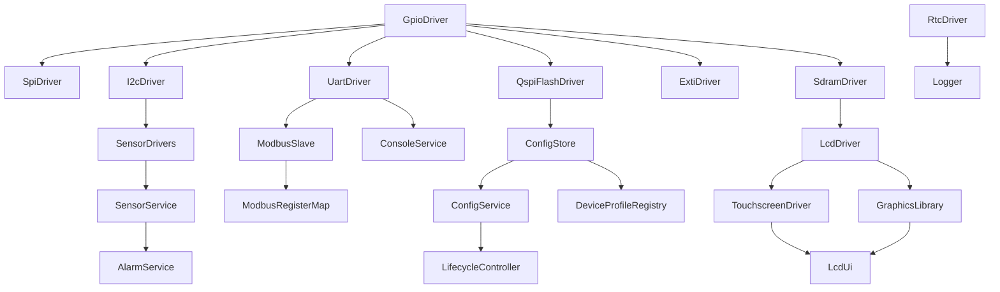
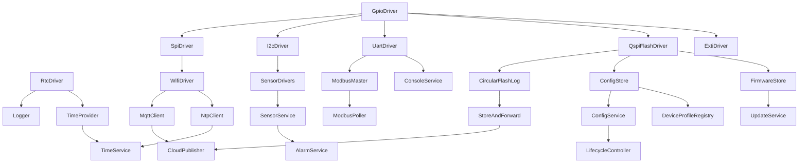

# LLD Gate Review — Boot-Order Graph and Task-Component Map
## Layer 3 Synthesis — Check 1 and Check 3

**Date:** 2026-05-21
**Branch:** `feature/lld-layer-3-synthesis`

---

## 1. Init-dependency graph

An edge A → B means "A must be initialised before B."
The graph is verified acyclic by topological sort in `check_layer_3_synthesis()`.

### 1.1 Field Device (STM32F469)



**Pre-scheduler init sequence (FD, `main()` before `vTaskStartScheduler()`):**

| Step | Component | Notes |
|------|-----------|-------|
| 1 | `GpioDriver` | All GPIO clocks and alternate functions |
| 2 | `RtcDriver` | Reset-cause detection; BKP domain access |
| 3 | `Logger` | Bootstrap exception: reads RtcDriver directly for timestamps. Mutex created with `xSemaphoreCreateMutexStatic` (pre-scheduler safe). |
| 4 | FreeRTOS static objects | All `StaticTask_t`, `StaticQueue_t`, `StaticSemaphore_t` created in `main()` |
| 5 | `vTaskStartScheduler()` | |

**Post-scheduler (LifecycleTask sub-states):**

| Sub-state | Components initialised | Dependency satisfied |
|-----------|----------------------|----------------------|
| 1 | `QspiFlashDriver`, `ConfigStore` → integrity check | `GpioDriver` done pre-scheduler |
| 2 | `ConfigStore` load + `ConfigService` apply | `ConfigStore` OK from sub-state 1 |
| 3 | `I2cDriver`, sensor drivers, `SensorService`, `AlarmService` | `I2cDriver` requires `GpioDriver` |
| 4 | `SdramDriver`, `LcdDriver`, `GraphicsLibrary`, `TouchscreenDriver`, `LcdUi` | PH7 released by `LcdDriver`; `TouchscreenDriver` follows (TSD-D5) |
| 5 | `ModbusSlave`, `ConsoleService`, `HealthMonitor` | All hardware ready |

### 1.2 Gateway (STM32L475)



**Post-scheduler (LifecycleTask sub-states, GW):**

| Sub-state | Components initialised | Notes |
|-----------|----------------------|-------|
| 1 | `QspiFlashDriver`, `ConfigStore` → integrity check | |
| 2 | `ConfigStore` load + `ConfigService` apply | |
| 3 | `I2cDriver`, sensor drivers, `SensorService`, `AlarmService` | |
| 4 | `SpiDriver`, `WifiDriver`; `CircularFlashLog`; `MqttClient`; `StoreAndForward`; `CloudPublisher`; `NtpClient`; `TimeProvider`; `TimeService`; `ModbusMaster`; `ModbusPoller`; `FirmwareStore`; `UpdateService`; `ConsoleService`; `HealthMonitor` | All in one pass once WiFi and flash are ready |
| 5 | Self-check (`LifecycleController` transitions to Running) | |

### 1.3 Bootstrap exception — Logger ↔ TimeProvider

Logger requires timestamps at init time. TimeProvider depends on NTP and RTC being ready — both of which are not available until post-scheduler. To break the circular dependency:
- `logger_init()` is called pre-scheduler and reads the RTC directly via `rtc_get_time()`.
- `TimeProvider` has no dependency on Logger at init.
- Logger does **not** depend on TimeProvider at any point.

The graph is therefore acyclic. Topological sort confirms no cycle (verified by `_topo_sort_init_deps()` in the gate check).

---

## 2. Topological init order (full combined graph)

The following is one valid topological ordering covering both boards' components:

```
GpioDriver, RtcDriver, SimulatedSensorDrivers,
ExtiDriver, SpiDriver, I2cDriver, UartDriver, QspiFlashDriver, SdramDriver,
Logger,
CircularFlashLog, ConfigStore, FirmwareStore,
ConfigService,
SensorDrivers,
LcdDriver,
ModbusMaster, ModbusSlave, WifiDriver,
SensorService, AlarmService, GraphicsLibrary, TouchscreenDriver,
ModbusRegisterMap, ModbusPoller, MqttClient, NtpClient, TimeProvider,
LcdUi, StoreAndForward,
CloudPublisher, TimeService, UpdateService,
ConsoleService, HealthMonitor,
LifecycleController, DeviceProfileRegistry
```

**Result: ACYCLIC — no cycle detected.**

---

## 3. Task-component map

### 3.1 Field Device tasks

| Task | Priority | Stack | Components hosted |
|------|----------|-------|-------------------|
| `SensorTask` | 5 | 2 KB | `SensorService`, `AlarmService` |
| `ModbusSlaveTask` | 4 | 2 KB | `ModbusRegisterMap`, `ModbusSlave` |
| `LcdUiTask` | 2 | 4 KB | `LcdUi`, `GraphicsLibrary` callbacks |
| `ConsoleTask` | 1 | 2 KB | `ConsoleService` |
| `LifecycleTask` | 1 | 1 KB | `LifecycleController` |
| *(Idle + Timer)* | 0 / 7 | ~1 KB | Built-in |

Passive components (no dedicated task — called from hosting task):
`GpioDriver`, `RtcDriver`, `SpiDriver`, `I2cDriver`, `UartDriver`, `QspiFlashDriver`,
`ExtiDriver`, `SdramDriver`, `LcdDriver`, `TouchscreenDriver`, `Logger`, `ConfigStore`,
`ConfigService`, `SensorDrivers`, `HealthMonitor`, `DeviceProfileRegistry`

### 3.2 Gateway tasks

| Task | Priority | Stack | Components hosted |
|------|----------|-------|-------------------|
| `SensorTask` | 5 | 2 KB | `SensorService`, `AlarmService` |
| `ModbusPollerTask` | 4 | 2 KB | `ModbusPoller`, `ModbusMaster` |
| `WifiTask` | 3 | 1 KB | `WifiDriver` |
| `CloudPublisherTask` | 2 | 8 KB | `CloudPublisher`, `MqttClient`, `StoreAndForward` calls |
| `TimeServiceTask` | 2 | 3 KB | `TimeService`, `NtpClient` |
| `UpdateServiceTask` | 1 | 4 KB | `UpdateService`, `FirmwareStore` |
| `ConsoleTask` | 1 | 2 KB | `ConsoleService` |
| `LifecycleTask` | 1 | 1 KB | `LifecycleController` |
| *(Idle + Timer)* | 0 / 7 | ~1 KB | Built-in |

Passive: `GpioDriver`, `RtcDriver`, `SpiDriver`, `I2cDriver`, `UartDriver`, `QspiFlashDriver`,
`ExtiDriver`, `Logger`, `ConfigStore`, `ConfigService`, `CircularFlashLog`, `TimeProvider`,
`ModbusMaster` (passive within `ModbusPollerTask`), `HealthMonitor`, `DeviceProfileRegistry`

### 3.3 Shared-resource synchronisation check

| Resource | Callers (tasks) | Guard | §3 declaration | Result |
|----------|----------------|-------|----------------|--------|
| `Logger` | All tasks | `logger_mutex` | ✓ `logger.md` §3 | PASS |
| `ConfigStore` | `LifecycleTask`, `ConsoleTask`, `ModbusSlaveTask` / `ModbusPollerTask` (via `ConfigService`) | `config_store_mutex` | ✓ `config-store.md` §3 | PASS |
| `HealthMonitor` | All tasks (writers + readers) | `health_mutex` | ✓ `health-monitor.md` §3 | PASS |
| `WifiDriver` (GW) | `WifiTask` only (D29 — sole SPI owner) | — (no mutex needed) | ✓ `task-breakdown.md` §7 | PASS |

**Result: 0 task-boundary BLOCKERs — all shared resources have declared sync primitives.**
